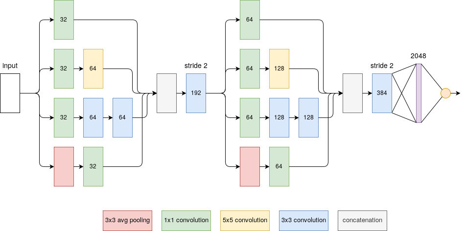

## Description
The code is for the task of gait recognition (or person identification) on the [MVLP gait dataset](http://www.am.sanken.osaka-u.ac.jp/BiometricDB/GaitMVLP.html). The network employs two Inception modules together with 2 additional convolutions and a fully-connected layer.
* The input is a pair of GEIs concatenated along the channel dimension, i.e. the shape of input tensor is `b * h * w * 2` with batch size `b`.
* The output indicates a probability (provided by a sigmoid) that the two input GEIs are come from the same subject.



This work is to support a project of my friend.

## Require
* Numpy
* Pytorch
* Torchvision

## Usage
```
python main.py --task training --epoch 30 --scale 0.25 --angle 90 --batch 12
```
* --task: "training" or "evaluation"
* --batch: batch size
* --epoch: range of epochs for training or a specific epoch for evaluation
* --scale: parameter scaling the input spatial dimensions
* --angle: the angle of interest (the gallery and probe angles must be the same)

## Notice
* Path to the dataset can be assigned in the file [main.py](./main.py).
* This code applies for a single angle, i.e. it considers only a camera angle in both training and evaluation stages. Experiments on different angles are independent.
* The training can be resumed by specifying the epoch range. For example, use ```--epoch 10-20``` to load the model at the 10th epoch and continue to train until the 20th epoch.
* If the task is "training", using ```--epoch 10``` means ```--epoch 0-10```.

## Example
Training a model with GEIs of size `32 * 22` (original size in MVLP gait dataset is `128 * 88`) corresponding to the camera angle of 90 degrees for 30 epochs and batch size 12:
```
python main.py --task training --epoch 30 --scale 0.25 --angle 90 --batch 12
```
Evaluating rank-1 recognition accuracy of the model at the 30th epoch:
```
python main.py --task evaluation --epoch 30 --scale 0.25 --angle 90 --batch 12
```

## Result
Highest rank-1 recognition accuracies I have obtained for GEIs of size `32 * 22`:
| Angle (degree) | 0| 30 | 60| 90 |
| --------------- | ---------- | ---------- | ---------- | ---------- |
| Accuracy (%) |    78.2     | 90.7 | 88.0 | 92.7 |